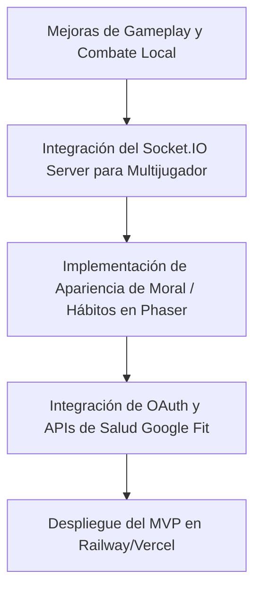

# Análisis de Desarrollo: Gains & Goblins
**El MMORPG Gamificado del Siglo XXI**

---

> [!IMPORTANT]
> **Manifiesto del Desarrollador (Rol Asumido)**
> Este documento fue redactado desde la perspectiva de un **desarrollador web y de videojuegos profesional, crítico y creativo**. No nos limitamos a listar componentes de código; evaluamos la viabilidad técnica, la psicología de juego (gamificación), el *game feel* y proponemos mecánicas disruptivas para transformar una gran idea en un videojuego adictivo y pulido.

---

## 1. Análisis Técnico del Proyecto Actual

El estado del proyecto muestra una base sólida de prototipado rápido en 2D que combina el desarrollo web clásico con la programación de videojuegos mediante **Phaser 3** y un backend en **Node.js (Express + Prisma + PostgreSQL)**.

### Puntos Fuertes de la Implementación Actual:
1. **Generación Procedural de Recursos (`BootScene.js`)**: El hecho de que todo el tileset y los spritesheets del jugador, enemigos, hechizos y partículas se generen por código usando Canvas es brillante para un proyecto web ligero. Reduce drásticamente los tiempos de carga y elimina la necesidad de alojar/gestionar assets de imágenes en crudo durante la fase inicial.
2. **Sistema de Evolución Visual Basado en Estadísticas**: La modificación del spritesheet del jugador en tiempo real en base a sus estadísticas (`strength`, `dexterity`, `intelligence` >= 10) encaja perfectamente con el espíritu de *Fable*.
3. **Mecánicas de Combate Locales**: La inclusión de ataques cargados (corte circular de espada, flecha perforante y explosión mágica de área), esquiva con voltereta (i-frames) y hechizos secundarios (escudo de maná, espadas orbitales) aporta una profundidad superior a la de un RPG web básico.
4. **Diseño de Retención e Inactividad**: El backend implementa reglas implacables de habit-building:
   - *Decay semanal*: Pérdida de 1 punto de estadística si no se registran al menos 3 actividades.
   - *Decay por Larga Inactividad*: Penalización del 30% en estadísticas y reducción de 2 niveles tras 21 días offline, con un riguroso "Periodo de Recuperación" (consistencia de 4 semanas).
   - *Bloqueo de Nivel (Balanced Growth)*: El nivel del personaje está topado si las estadísticas no crecen de forma equilibrada (todas deben ser `>= 5 + Level`).

---

## 2. Comparativa: Plan de Desarrollo (`fable_plan_v2.docx`) vs. Implementación Actual

A continuación, contrastamos los hitos descritos en la hoja de ruta y la visión del documento original con lo que ya está implementado en la base de código.

| Característica / Hito | Estado en el Plan | Estado en el Código | ¿Qué falta para completarlo? |
| :--- | :--- | :--- | :--- |
| **Combate Sin Clases** | 3 ramas de combate (melee, rango, magia) accesibles de forma libre. | **Implementado**. Armas e interfaz sincronizadas en el cliente. | Ajustar balances de escalado en fases tardías. |
| **Afinidad Orgánica** | Bono pasivo de +15% y apariencia según hábitos de los últimos 30 días. | **Parcialmente Implementado**. Calcula la rama dominante y da el bono en el cliente. | El backend guarda la afinidad, pero falta el impacto visual único en el sprite de Phaser (auras, cicatrices, postura). |
| **Sistema de Moral** | Apariencia cambia por consistencia de hábitos (brillo si 7 días, oscuro si 2 semanas) y elecciones morales de misiones. | **Parcialmente Implementado**. El valor `moral` se actualiza al empujar NPCs o realizar misiones. | Falta el impacto estético en el renderizado del sprite (hacer que brille o se oscurezca de acuerdo al valor moral). |
| **Multijugador (Fase 2)** | Sincronización en tiempo real de jugadores con Socket.IO en mapas. | **No Implementado**. El juego es 100% monojugador en el cliente actual. | Integrar Socket.IO en el backend, serializar movimientos del jugador y renderizar "otros jugadores" en `WorldScene`. |
| **Chat del Mundo y Emotes** | Chat e interacción social directa. | **No Implementado**. | Crear overlay HTML/CSS para el chat y sincronizar mensajes por sockets. |
| **Integración con APIs (Google Fit)** | Carga automática de actividad real y cardio. | **No Implementado**. La sincronización actual de actividades es puramente manual. | Implementar el flujo OAuth2 en backend/frontend para consumir la API de Google Fit / HealthKit. |
| **Sistema de Gremios** | Creación de gremios, estadísticas grupales y retos conjuntos. | **No Implementado**. | Diseñar tablas de Gremio en Prisma y endpoints de administración y reclutamiento. |
| **10 Misiones Principales** | Historia y progresión del MVP (3-5 horas de juego). | **Parcialmente**. Estructura de misiones básica (`QuestSystem`) y diarias (`DailyMissionSystem`) activas. | Faltan los diálogos de historia, scripts de avance y una mazmorra diseñada con mecánicas únicas de Boss. |
| **Economía de Jugadores** | Tiendas, comercio cara a cara y subasta. | **Parcialmente**. El sistema de tiendas con NPCs funciona. | Implementar el intercambio directo entre jugadores (*P2P Trading*) y persistencia de ofertas. |

---

## 3. Crítica Profesional: Puntos de Fricción y Oportunidades

Como diseñadores y desarrolladores, debemos ser implacables con las mecánicas del juego para evitar el abandono de los usuarios. Identificamos los siguientes riesgos y sus **soluciones implementadas**:

### 1. El Riesgo de Estilo de Vida Sedentario para Magos (Sinergia Física-Mental)
* **El Problema**: Si eliminamos la barrera de "Crecimiento Equilibrado" para permitir especialización, un jugador podría dedicarse únicamente a leer/estudiar en la vida real (para ser un mago poderoso en el juego) cayendo en un estilo de vida sedentario y poco saludable.
* **La Solución Implementada (Energía Vital - ⚡)**: Introdujimos el sistema de **Energía Vital (Vitalidad)**. 
  - La Vitalidad tiene un límite de 300 puntos y se recarga únicamente cuando el jugador registra actividades físicas del mundo real (Cardio o Fuerza), sumando **+100 de Vitalidad** por actividad.
  - Para realizar actividades pasivas en el juego (como estudiar grimorios o meditar), se requiere consumir **20 de Vitalidad** por sesión. 
  - Si el jugador no realiza actividad física real, su personaje se quedará "fatigado", impidiéndole estudiar o meditar en el juego. Esto vincula de manera orgánica y obligatoria la salud física con el crecimiento del poder mágico y la fuerza de voluntad.

### 2. El Abuso del Registro Manual y Falta de Inmersión
* **El Problema**: Registrar hábitos mediante clics directos es propenso a trampas y reduce el valor emocional de la progresión. Además, la biblioteca y las salas de meditación del gremio eran puramente decorativas.
* **La Solución Implementada (Interacciones Físicas In-Game)**: 
  - **Mesa de Estudio y Grimorios (Biblioteca)**: Se implementó una mesa de estudio interactiva con silla y un libro abierto en la zona norte de la biblioteca, así como la posibilidad de usar las estanterías de libros.
  - **Tapetes de Meditación**: Se hicieron interactivos los tapetes en la zona este del Gremio.
  - Al interactuar con ellos (tecla `E`), se inicia un temporizador de **10 segundos** de concentración (enfoque Pomodoro abreviado) donde el jugador es congelado en una animación con partículas de flujo. Al completarse, consume **20 de Vitalidad** y otorga **+50 XP** y **+1 punto de Inteligencia/Voluntad**, resolviendo el registro instantáneo sin esfuerzo.

---

## 4. Propuesta de Rediseño: Mecánicas de Combate Creativas e Interactivas

Para que el combate de Gains & Goblins no se sienta como un clon genérico de *Zelda* clásico, sugerimos mecánicas que conecten directamente los **hábitos del mundo real con el gameplay táctico**.

### 1. El Combo Rítmico de Hábitos (Espada)
*Vinculado a Fuerza y Resistencia.*
* **Mecánica**: El ataque básico de espada no es solo spamear barra espaciadora. Introducir una barra de tempo visual debajo del personaje al golpear.
* **Detalles**:
  - Si presionas el espacio justo en el pico del ritmo, encadenas golpes: **Tajo Horizontal (Básico) ➔ Estocada (Perfora armadura) ➔ Martillazo (Knockback y aturdimiento)**.
  - La ventana de tiempo para el combo rítmico se amplía de acuerdo a tu estadística de **Resistencia** (cuanto más cardio/pesa real hagas, más control rítmico y menos fatiga tienes en combate).

### 2. La Zona de Tensión y Precisión (Arco)
*Vinculada a Destreza y Velocidad.*
* **Mecánica**: Mantener pulsada la barra espaciadora dibuja la trayectoria de la flecha en la pantalla.
* **Detalles**:
  - Si sueltas la tecla en el **frame exacto** de la tensión máxima (indicado por un destello verde en el arco), el disparo inflige un **impacto crítico** (+50% daño) y tiene efecto de perforación total.
  - Si la mantienes demasiado tiempo, el brazo del personaje tiembla y la flecha se desvía. La velocidad a la que se tensa el arco escala con **Velocidad**, mientras que la estabilidad de la mira escala con **Destreza**.

### 3. Reacciones Elementales / Hechizos Catalizadores (Magia)
*Vinculada a Inteligencia y Maná.*
* **Mecánica**: Los hechizos básicos aplican estados alterados que se pueden detonar con armas físicas.
* **Detalles**:
  - **Hechizo de Escarcha**: Ralentiza a los enemigos. Si disparas una flecha cargada a un enemigo congelado, este estalla infligiendo daño de astillas en área.
  - Hechizo de **Ignición**: Quema al enemigo. Un golpe de espada en combo rítmico sobre un enemigo en llamas causa una explosión térmica que lo empuja hacia atrás.
  - Esto fomenta el cambio dinámico de armas (estilo Fable) durante el combate, recompensando al jugador híbrido (el que lee y hace ejercicio).

### 4. Sobrecarga de Hábito (Ultimate Ability)
*Vinculada a la consistencia semanal.*
* **Mecánica**: Un botón de "Ráfaga de Disciplina" que solo se puede activar si has cumplido tu objetivo diario de hábitos.
* **Detalles**:
  - Al activarse, el personaje entra en un estado de trance heroico durante 15 segundos: **inmunidad a retrocesos, coste de maná reducido a 0, y velocidad de ataque duplicada**.
  - Visualmente el personaje emite un aura dorada cegadora (el resplandor de la disciplina). Esto vincula de forma directa y emocional el logro del día en la vida real con la dominación de las mazmorras más difíciles del juego.

### 5. Bloqueo Perfecto / Parry
*Vinculado a Voluntad.*
* **Mecánica**: Al usar la espada, si pulsas una tecla de defensa (ej. `C` o clic derecho) en el instante milimétrico antes de recibir un impacto enemigo, bloqueas el 100% del daño y realizas un desvío.
* **Detalles**:
  - El enemigo queda aturdido por 1.5 segundos, permitiendo un golpe crítico melee inmediato.
  - El tamaño de la ventana para realizar el bloqueo perfecto aumenta según tu estadística de **Voluntad** (entrenada mediante meditación y yoga en la vida real, lo que simboliza tu enfoque mental bajo presión).

---

## 5. Próximos Pasos en el Desarrollo (Hoja de Ruta Recomendada)

Para avanzar ordenadamente hacia la Fase 2 del MVP sin desestabilizar el código actual, sugerimos la siguiente prioridad de tareas:

1. **Sprint 1 (Pulido de Combate)**: Implementar el sistema de Combo Rítmico y la Precisión del Arco para mejorar el *game feel* y la interacción.
2. **Sprint 2 (Base Multijugador)**: Configurar Socket.IO en el backend y crear el sistema de sincronización posicional básico de jugadores.
3. **Sprint 3 (Gamificación Visual)**: Conectar los estados de moral e inactividad en el cliente para pintar los efectos dinámicos en el personaje (brillos, oscurecimiento, etc.).
